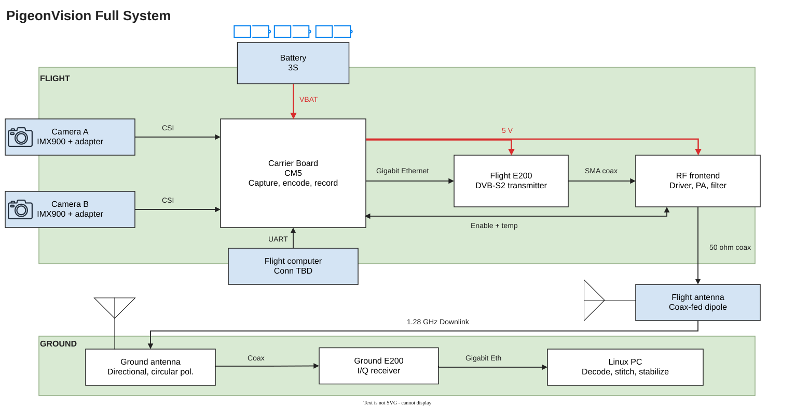

# Hardware

[Edit in draw.io](system.drawio)

| Assembly | Job |
| --- | --- |
| [Carrier](carrier/README.md) | CM5, power, cameras, sensors and service connections. |
| [RF frontend](rf-frontend/README.md) | Attenuation, driver, PA and output filter. |
| Camera adapters, two copies | FRAMOS PixelMate-to-MC50 boards and cables; purchased parts preferred. |
| Flight E200 | DVB-S2 transmitter, mounted above the carrier and connected by Ethernet and SMA coax. |
| Ground E200 | RF receiver connected to the Linux PC over Ethernet. |

**Cur Plan:** KiCad carrier and RF boards, purchased CM5, radios and camera adapters.
