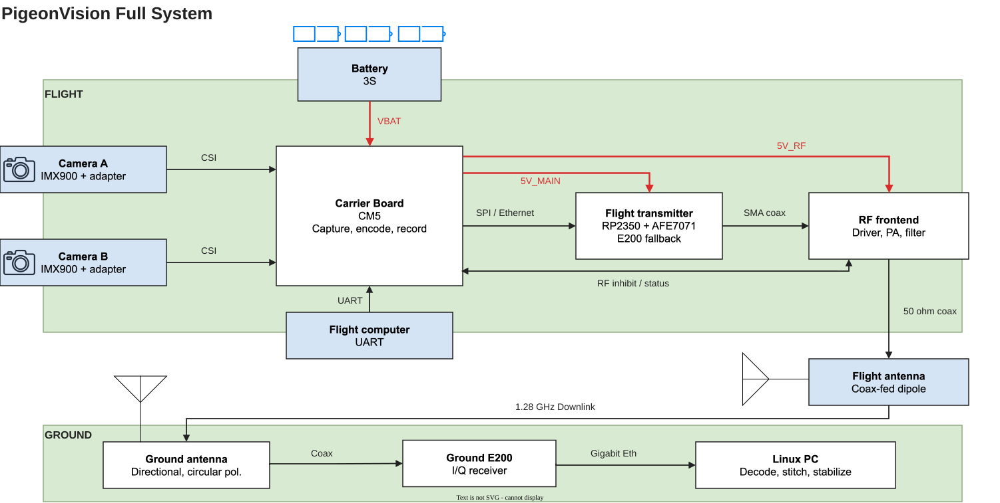

# Hardware

One CM5 captures two fisheye cameras. SPI feeds an RP2350 + AFE7071 transmitter; Ethernet supports an E200 fallback. The ground E200 and Linux PC receive, decode and stitch.

[Edit diagram](system.drawio)

- [Carrier](carrier/README.md): compute, cameras, power and sensors.
- [Transmitter](https://github.com/Rivercraft911/RP2350_IQ_Benchmark/tree/main/hardware/devboard): RP2350, DAC/modulator, clocks and LO. Hardware draft.
- [RF frontend](rf-frontend/README.md): driver, PA and output filter.
- [Project library](libraries/README.md): KiCad parts and CM5 placement.

Use one flight transmitter at a time, connected by SMA coax to the separate PA/filter board. Swap cables/configuration for the E200 fallback. The diagrams show the planned interfaces, not a completed schematic.
