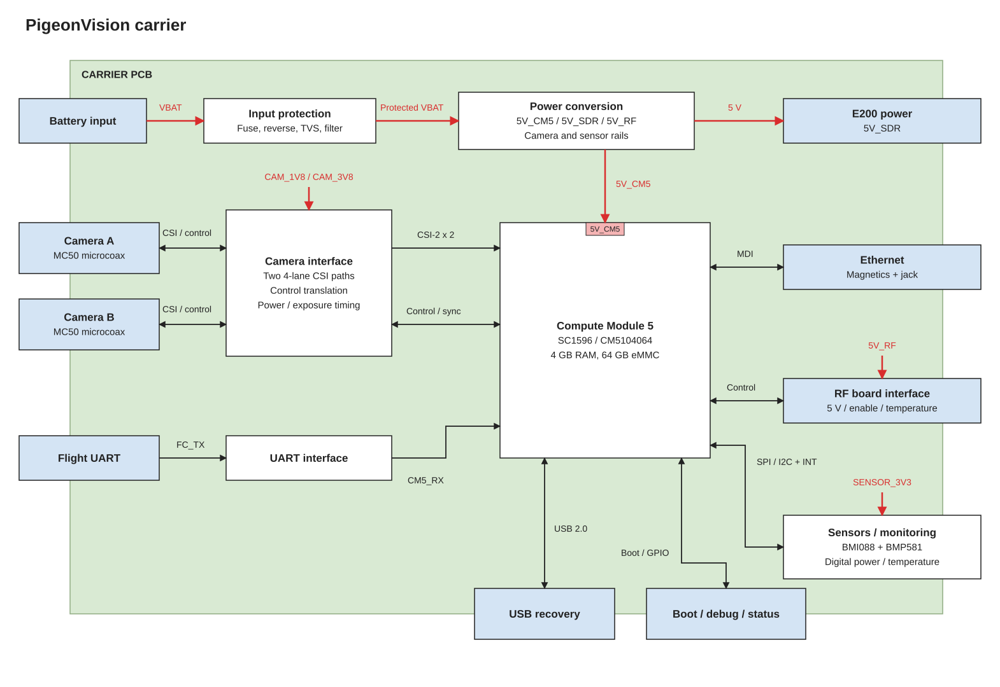

# Carrier

**Cur Plan:** one CM5, two cameras, E200, power and sensors. Record to eMMC; retrieve over Ethernet. No separate MCU.

[Edit in draw.io](block-diagram.drawio)

| Block | Part / connection |
| --- | --- |
| Compute | SC1596 / CM5104064, 4 GB RAM, 64 GB eMMC. |
| Battery input | 3S preferred; 4S compatibility proposed. Fuse, reverse protection, TVS and input filter. |
| Power | Switched 5 V branches for CM5, E200 and RF frontend; camera and sensor rails. |
| Cameras | Two FRAMOS IMX900 modules, CIL212 lenses and FRAMOS FFA-A/MC50 adapters. I-PEX 20525-050E-02 on the carrier. |
| Sensors | BMI088 IMU and BMP581 barometer, shared with Aerolotl. ADXL375 high-g accelerometer optional. Digital power and temperature sensing. |
| Flight UART | Receive-only telemetry; voltage and protocol TBD. |
| Service | USB recovery, boot selector, debug UART, Ethernet and record/shutdown control. No native microSD with the eMMC CM5. |

Include camera level translation, power sequencing and hardware exposure sync.

Use Aerolotl's sensor parts for simpler sourcing and shared sensor code where practical. Read them directly from CM5. BMI088 gyro range is ±2000°/s (5.56 turns/s); check expected spin before finalizing it. BMP581 covers 300–1250 hPa; revisit its range for a future 30,000 ft flight.

Camera path: PixelMate → purchased FFA-A/MC50 board → MC50 cable → carrier. The [FRAMOS kit](https://www.mouser.com/en/ProductDetail/FRAMOS/FFA-MC50-Kit-0.3m?qs=%252BHhoWzUJg4K3LtaE207mhw%3D%3D) includes both adapters and a 300 mm cable. The carrier replaces the processor-side adapter. Confirm camera screw spacing and cable length before layout.

Mount the bare E200 on standoffs above the carrier. Connect with a short Ethernet cable and separate regulated 5 V. The carrier jack also serves bench access; simultaneous connections need a switch.

Provide rail/enable/reset test points and status LEDs. PA enable defaults off.

Before layout: confirm board outline, mounting holes, camera pinout, rail currents and startup order.

References: [CM5 datasheet](https://datasheets.raspberrypi.com/cm5/cm5-datasheet.pdf), [FRAMOS MC50 mapping](https://docs.framos.com/en/latest/FSMEcosystem/ProductDocumentation/FFA/FFA-MC.html), [BMI088](https://www.bosch-sensortec.com/en/products/motion-sensors/imus/bmi088), [BMP581](https://www.bosch-sensortec.com/en/products/environmental-sensors/pressure-sensors/bmp581).
