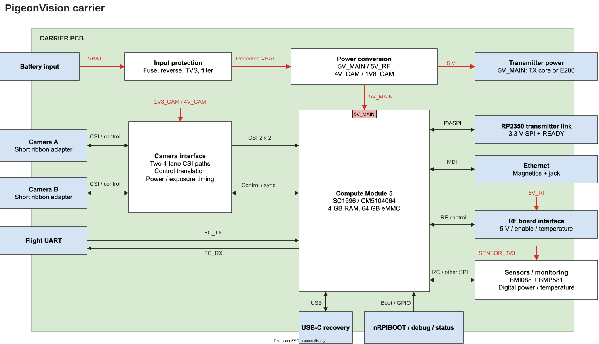

# Carrier

**Current plan:** one CM5, two cameras, SPI to the RP2350 transmitter and Ethernet for service or the E200 fallback. Record to eMMC. Use a 3S 5 Ah battery; one hour including pad time is a planning target. The RP2350 lives on the transmitter board. Carrier diameter is 5.7 in (144.78 mm).

[Edit diagram](block-diagram.drawio) · [KiCad project](PigeonCarrier/PigeonCarrier.kicad_pro) · [Design master](../../calculations/design-master.xlsx)

| Block | Parts / connection |
| --- | --- |
| Compute | SC1596 / CM5104064: 4 GB RAM, 64 GB eMMC |
| CM5 connectors | 2 × Amphenol 10164227-1001A1RLF, 1.5 mm stack |
| Cameras | 2 × FRAMOS IMX900 + CIL212; retain the working FRAMOS adapters. Two Hirose FH12-22S-0.5SH(55) FFC connectors with CM5IO-style pinout |
| Input protection | LM74502DDFR, 2 × CSD18540Q5B, SMBJ18CA; fuse still to select |
| Main 5 V | LM61495RPHR; CM5 and transmitter core or E200 |
| RF 5 V | TPS62933FDRLR; separate supply, default off |
| Camera rail | TPS62933FDRLR: shared 3V3_CAM from VBAT, enabled by 3V3_CM5; adapter boards provide camera-specific rails |
| Battery monitor | INA226AIDGSR + WSL25125L000FEA18, 5 mΩ |
| Sensors | BMI088, BMP581 and INA226 on CM5 GPIO2/3 I²C; polling without interrupt wiring |
| Camera control | Dedicated CM5 camera I²C lines; CAM0_RST from J1.97 and CAM1_RST from J1.100. Synchronization access reserved, synchronized exposures not required |
| Ethernet | EDAC A70-112-331N126 with integrated magnetics |
| Service | USB-C data/recovery, nRPIBOOT shunt and PWR_BUT button on carrier; separate USB-C, BOOTSEL, reset and SWD on transmitter |
| Flight UART | Receive required; return TX optional. Logic voltage, connector and protocol TBD |

Both camera connectors receive the shared 3V3_CAM rail; MIPI connects directly to CM5. Keep the working adapter boards and their camera-specific power sequencing. The carrier does not replace their internal regulator circuitry.

Sensors use CM5 3.3 V. The transmitter core gets 5V_MAIN and makes its own local rails; the selected GRF5613 PA uses switched 5V_RF. Keep space, 5 V power and Ethernet for the E200 fallback. The bench input is a PJ-102AH barrel jack beside the battery connector, used with the battery unplugged.

Reserve these CM5 pins for PV-SPI. J1 numbers are the module connector pads, not IO-board header positions.

| Signal | CM5 GPIO | J1 pad | Pico Plus 2 GPIO |
| --- | --- | --- | --- |
| SCK | 11 | 38 | 17 |
| MOSI | 10 | 44 | 18 |
| CS_N | 8 | 39 | 19 |
| READY | 25 | 41 | 22 |
| MISO, reserved | 9 | 40 | 20 |

3.3 V logic with CM5 GPIO_VREF tied to CM5 3.3 V, common GND, 20 MHz SPI mode 0. On the transmitter: 4.7 kΩ CS_N pull-up and 4.7–6.8 kΩ READY pull-down. MISO is unused in v1. Keep sensors off this dedicated SPI bus. Transmitter reset and its connector pin numbering remain to be assigned.

The RF buck enable is GPIO17 / J1.50, with its existing 10 kΩ pull-down. Reserve GPIO22 / J1.46 for a separate 3.3 V PA_EN request. The proposed four-pin Molex 0430450418 PA connector carries 1: 5V_RF, 2: GND, 3: PA_EN, 4: GND. Local PA circuitry must default off and handle GRF5613 shutdown polarity and bias. This interface is a pin plan; it has not been wired into the carrier schematic. [PA plan](../rf-frontend/README.md).

PV-SPI v1 carries video only; USB currently starts/configures the Pico. Autonomous startup and status/control still need firmware work. USB-C service ports must not backfeed the battery rails. [Protocol](https://github.com/Rivercraft911/RP2350_IQ_Benchmark/blob/main/docs/pv-spi-spec.md) · [Measured SPI result](https://github.com/stanford-ssi/PigeonVision/blob/main/software/flight/spi.md)

Power control: J4 on the Regulators sheet connects an external pull-pin switch. Pin 1 is U2's `EN/UVLO` node (`PWR_EN`); pin 2 is GND. The switch must be **closed with the pin inserted (off), open with the pin removed (on)**. Closing it disables the LM74502 and both input MOSFETs; opening it restores the existing UVLO divider. It carries control current, about 1.68 mA at 12.6 V, rather than load current. This is not a latch: shut down the CM5 before reinserting the pin. An unplugged switch cable also permits startup.

With the pin inserted, the present dividers draw approximately `12.6 V / 7.5 kohm + 12.6 V / (51 + 4.7) kohm = 1.91 mA`, plus controller shutdown current and leakage. Off means battery power to downstream loads is disabled, not zero battery drain or isolation from external power. J4's connector/footprint and the mechanical switch remain to be selected; J4 has not been added to the PCB. Contact bounce and power transitions need bench verification. [LM74502 datasheet](https://www.ti.com/lit/ds/symlink/lm74502.pdf), sections 5, 6.5 and 8.3.

Camera, sensor, Ethernet and USB/service hierarchy is connected, along with CM5 power/grounds and both regulator enables. The carrier USB-C port uses host VBUS only for data-switch control, with no connection to the battery or 5 V power rail. Its ESD footprint uses explicit external copper connections from each protected pad to the opposite NC pad. USB enumeration, recovery and power transitions remain hardware checks. Cooler fan connection, transmitter/Yapogee and PA interfaces still need completion; full-project ERC is not clean.

The design master still budgets E200 power. Add a separate RP2350 + AFE7071 core load once estimated, keeping the E200 fallback as an alternative. GRF5613 is selected for PA planning; its loaded current and thermal performance remain unmeasured. Confirm mounting and connector access before final layout.

[Library and sourcing](../libraries/README.md) · [CM5 datasheet](https://datasheets.raspberrypi.com/cm5/cm5-datasheet.pdf) · [Camera datasheet](https://www.mouser.com/catalog/specsheets/FRAMOS_2-12-2026_FSM.GO-IMX900_Datasheet_v1.2a.pdf)
