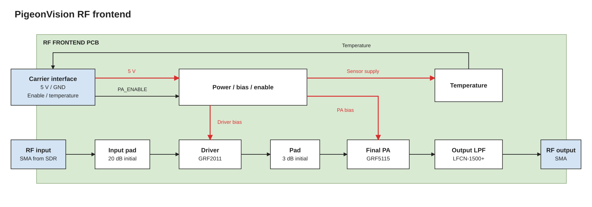

# RF frontend

**Cur Plan:** E200 → attenuator → driver → PA → filter → antenna. Target 0.5 W average DVB-S2 output at the PA, initially at 1.28 GHz. Final frequency and power need approval and bench testing.

[Edit diagram](block-diagram.drawio) · [Link budget](../../calculations/link-budget.xlsx)

| Stage | Part / starting value |
| --- | --- |
| Input pad | Fixed 50 Ω attenuator; 20 dB starting option |
| Driver | GRF2011; optional assembly bypass |
| Interstage pad | 3 dB |
| PA | GRF5115, 1200–1400 MHz reference tune |
| Output filter | LFCN-1500+ low-pass |

SMA input/output. Carrier supplies 5 V and enable; local power filtering stays on this board. Include current test points and heatsink mounting.

Size attenuation from measured gain and waveform peaks. A 1 dB filter loss leaves about 0.4 W. Check modulation quality, spectrum and temperature; filtering cannot fix clipping.

[GRF2011](https://www.guerrilla-rf.com/products/detail/sku/GRF2011) · [GRF5115 reference circuit](https://www.guerrilla-rf.com/includes/prodFiles/5115/GRF5115%201200-1400%20MHz.pdf) · [LFCN-1500+](https://www.minicircuits.com/pdfs/LFCN-1500%2B.pdf)
